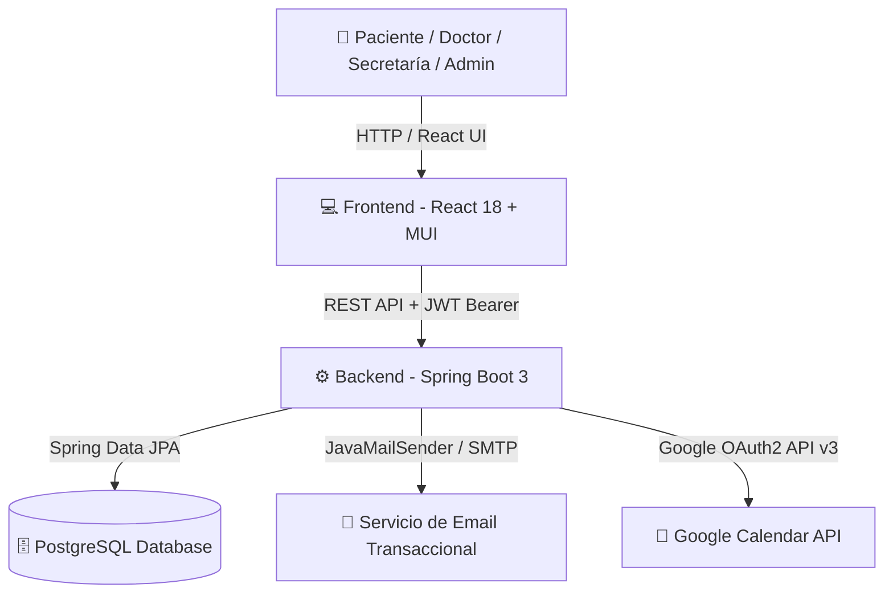

# 🏥 Sistema de Gestión de Turnos Médicos | Clinical Appointment Platform

[](https://spring.io/projects/spring-boot)
[](https://reactjs.org/)
[](https://www.postgresql.org/)
[](https://mui.com/)

Plataforma web integral y moderna para la **digitalización, automatización y optimización del flujo de turnos en centros de salud y consultorios médicos**. 

La solución ofrece una experiencia simple y accesible para pacientes al reservar citas online, un portal de gestión de agencias y disponibilidad en tiempo real para profesionales de la salud, e integración bidireccional con **Google Calendar** y servicios transaccionales de **correo electrónico**.

---

## 🌟 Características Principales (Key Features)

### 🧑‍⚕️ Módulo para Pacientes
- **Reserva Web Intuitiva**: Selección guiada en 4 pasos (*Especialidad => Profesional => Fecha y Hora => Confirmación*).
- **Gestión de Menores a Cargo**: Vinculación de dependientes/hijos bajo el perfil tutor para reservar turnos en su nombre.
- **Historial y Ficha Personal**: Panel para consultar turnos agendados, asistencias, cancelaciones y métricas estadísticas.
- **Sistema de Advertencias del Profesional**: Despliegue de carteles de indicación previa o avisos bloqueantes configurados por el médico.

### 🩺 Portal para Médicos
- **Control de Visibilidad Pública**: Switch para ocultar temporalmente el perfil de las búsquedas web de pacientes.
- **Configuración de Mensajes Personalizados**: 
  - *Advertencia Bloqueante*: Suspende la reserva web desplegando instrucciones personalizadas de contacto.
  - *Advertencia Informativa*: Despliega aclaraciones operativas permitiendo al paciente confirmar la cita.
- **Gestión de Agendas y Plantillas**: Creación de plantillas semanales reutilizables e instanciación concreta de slots horarios.
- **Edición de Slots**: Capacidad de inhabilitar turnos individuales o limpiar semanas completas.
- **Sincronización con Google Calendar**: Conexión OAuth2 por usuario para reflejar automáticamente los turnos agendados en su calendario personal.
- **Reportes y Resúmenes por Email**: Recepción programada de la agenda diaria de pacientes y estadísticas de actividad semanal.

### 👩‍💼 Módulo para Secretaría / Recepción
- **Reserva Presencial / Telefónica**: Agendamiento directo de turnos para pacientes registrados o nuevos pacientes sin necesidad de registro web previo.
- **Agenda Consolidada de Profesionales**: Vista unificada de citas médicas reservadas y horarios disponibles por médico y fecha.
- **Inhabilitación de Slots en Tiempo Real**: Capacidad de suspender o deshabilitar turnos libres individuales en la disponibilidad del médico.
- **Cancelación Justificada con Notificación**: Cancelación de citas con justificación obligatoria y envío automático de email informativo al paciente.

### 🛡️ Panel de Administración
- **Gestión de Especialidades Médicas**: Altas, bajas y modificaciones de especialidades y descripciones.
- **Gestión de Profesionales y Secretaría**: Alta de usuarios con rol `DOCTOR` o `SECRETARIA` y envío de credenciales/enlace de activación.
- **Control de Usuarios**: Búsqueda por correo, bloqueo/desbloqueo preventivo de accesos y eliminación definitiva.
- **Ejecución Manual de Notificaciones**: Botones para desencadenar el envío masivo de resúmenes diarios y reportes semanales.

---

## 🛠️ Tech Stack (Tecnologías Utilizadas)

### Frontend
- **Framework:** React 18 (Vite)
- **Interfaz de Usuario (UI):** Material UI (MUI v5), Emotion, Material Icons
- **Enrutamiento:** React Router DOM v6
- **Cliente HTTP:** Axios (con interceptores JWT automáticos)
- **Manejo de Fechas:** Day.js

### Backend
- **Core:** Java 17 & Spring Boot 3
- **Seguridad:** Spring Security + JWT (JSON Web Tokens) Stateless
- **Persistencia:** Spring Data JPA / Hibernate
- **Envío de Emails:** Spring Boot Starter Mail (JavaMailSender / SMTP)
- **Documentación OpenAPI:** Springdoc OpenAPI v2.0.0 (Swagger UI)
- **Integraciones:** Google APIs Client Library (Calendar API v3 & OAuth2)
- **Build Tool:** Maven

### Base de Datos & Almacenamiento
- **Motor:** PostgreSQL

---

## 🏗️ Arquitectura del Sistema



---

## 🚀 Requisitos Previos y Configuración Local

### Prerrequisitos
Asegúrate de contar con los siguientes elementos instalados en tu entorno:
- **Java JDK:** Versión 17 o superior
- **Node.js:** Versión 18.x o superior
- **PostgreSQL:** Versión 14.x o superior
- **Maven:** Versión 3.8+ (o el wrapper incluido `./mvnw`)

---

### 📥 1. Clonar el Repositorio

```bash
git clone https://github.com/tu-usuario/sistema-gestion-turnos.git
cd sistema-gestion-turnos
```

---

### ⚙️ 2. Configurar el Backend (Spring Boot)

1. Crea la base de datos en PostgreSQL:
   ```sql
   CREATE DATABASE consultorio_db;
   ```

2. Configura las variables de entorno o edita el archivo `src/main/resources/application.properties`:

   ```properties
   # Servidor
   server.port=8080

   # Base de Datos
   spring.datasource.url=jdbc:postgresql://localhost:5432/consultorio_db
   spring.datasource.username=postgres
   spring.datasource.password=tu_password
   spring.jpa.hibernate.ddl-auto=update
   spring.jpa.properties.hibernate.dialect=org.hibernate.dialect.PostgreSQLDialect

   # Seguridad JWT
   jwt.secret=TuClaveSecretaSuperSeguraParaFirmarTokensJWT1234567890

   # Configuración SMTP para Emails Transaccionales
   spring.mail.host=smtp.gmail.com
   spring.mail.port=587
   spring.mail.username=tu-email@gmail.com
   spring.mail.password=tu-app-password
   spring.mail.properties.mail.smtp.auth=true
   spring.mail.properties.mail.smtp.starttls.enable=true

   # Integración Google Calendar OAuth2
   google.client.id=TU_GOOGLE_CLIENT_ID.apps.googleusercontent.com
   google.client.secret=TU_GOOGLE_CLIENT_SECRET
   google.redirect.uri=http://localhost:8080/api/google-calendar/callback
   ```

3. Compila e inicia la aplicación Backend:
   ```bash
   ./mvnw spring-boot:run
   ```
   *La API estará disponible en `http://localhost:8080` y la documentación Swagger en `http://localhost:8080/swagger-ui.html`.*

---

### 💻 3. Configurar el Frontend (React + Vite)

1. Ve al directorio del frontend e instala las dependencias:
   ```bash
   cd frontend
   npm install
   ```

2. Crea un archivo `.env` en la raíz de la carpeta `frontend/`:
   ```env
   # Configuración de Backend y Almacenamiento
   VITE_SUPABASE_URL=https://tu-proyecto.supabase.co
   VITE_SUPABASE_ANON_KEY=tu-anon-key-de-supabase

   # Configuración Parametrizada del Consultorio / Instituto Médico
   VITE_CLINIC_NAME="Instituto Médico Consultorios"
   VITE_CLINIC_EMAIL="contacto@consultorio.com"
   VITE_CLINIC_LEGAL_EMAIL="legales@consultorio.com"
   VITE_CLINIC_PHONE="+54 11 1234-5678"
   VITE_CLINIC_WHATSAPP="+54 9 11 1234-5678"
   VITE_CLINIC_ADDRESS="Av. Principal 1234, CABA"
   VITE_CANCELLATION_HOURS="24 horas"
   VITE_TOLERANCE_MINUTES="15 minutos"
   VITE_JURISDICTION_CITY="Ciudad Autónoma de Buenos Aires"
   VITE_LAST_UPDATED_DATE="Agosto 2026"
   ```

3. Inicia el servidor de desarrollo local:
   ```bash
   npm run dev
   ```
   *La aplicación web estará disponible en `http://localhost:5173`.*

---

## 📂 Estructura del Proyecto

```text
SistemaDeGestionDeTurnos/
├── src/main/java/com/consultorio/
│   ├── config/             # Configuración de OpenAPI, Jackson, Security y Google API
│   ├── controller/         # Endpoints REST (Auth, Doctores, Pacientes, Turnos, Admin, etc.)
│   ├── domain/             # Entidades JPA (Doctor, Paciente, Turno, SlotHorario, etc.)
│   ├── dto/                # Data Transfer Objects para requests y responses
│   ├── repository/         # Interfaces de Spring Data JPA
│   ├── security/           # Filtros JWT, UserDetailsService y utilidades de seguridad
│   └── service/            # Lógica de negocio (Reserva, Disponibilidad, Plantillas, Email)
├── src/main/resources/
│   ├── application.properties # Parámetros de entorno y conexiones
│   └── templates/          # Plantillas de correo electrónico HTML
├── frontend/
│   ├── src/
│   │   ├── api/            # Clientes de servicios API con Axios
│   │   ├── components/     # Componentes reutilizables de UI (Navbar, Footer, Modales)
│   │   ├── context/        # Contexto global de autenticación (AuthContext)
│   │   ├── pages/          # Vistas principales organizadas por módulo (admin, doctor, paciente, secretaria)
│   │   └── config/         # Configuración clínica parametrizable
│   ├── package.json
│   └── vite.config.js
└── README.md
```

---

## 📖 Documentación Interactiva de la API (Swagger UI)

Una vez iniciado el servidor backend, explora y prueba todos los endpoints directamente desde tu navegador en:
👉 **`http://localhost:8080/swagger-ui.html`**


<p center="left">
  Desarrollado por Agustin Gallegos, estudiante de Ingenieria en Sistemas en UTNBA como proyecto personal.
</p>
